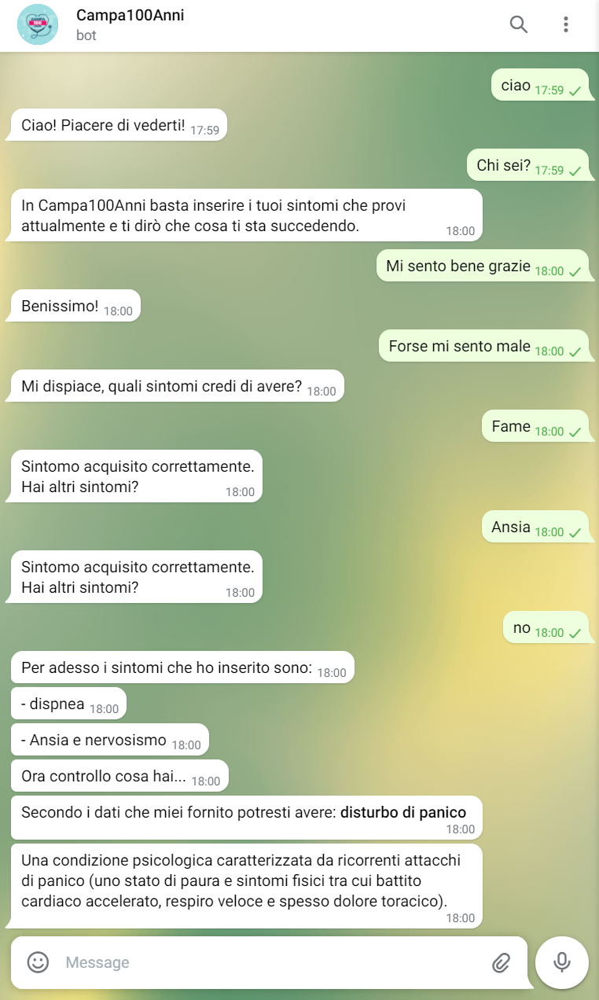
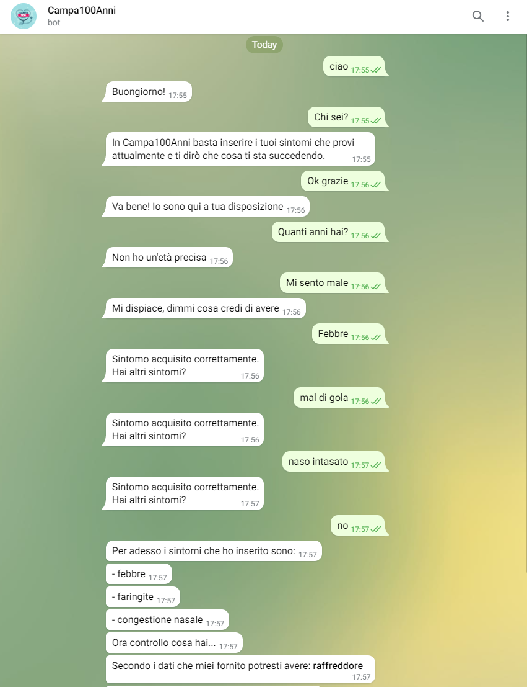
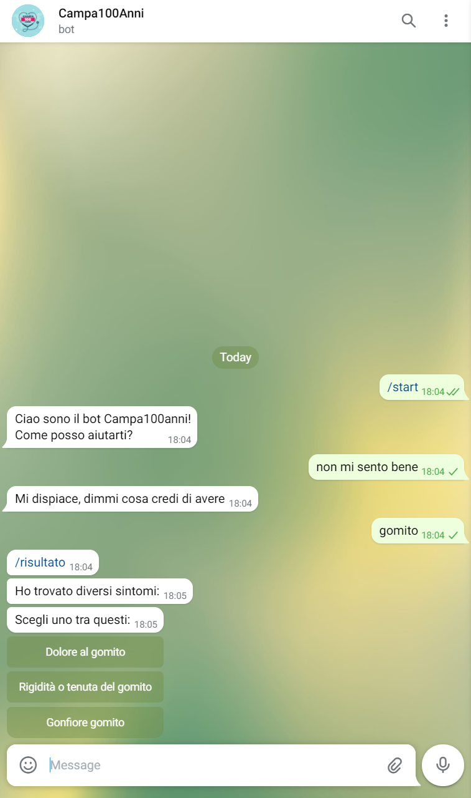
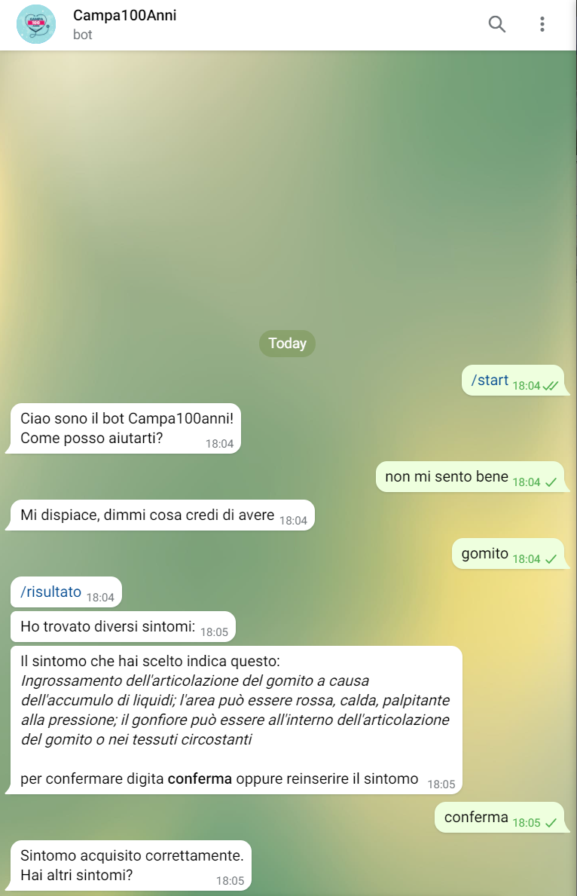

# Documentazione Campa100Anni

# Indice
1. [Introduzione](#Introduzione)
2. [Requisiti specifici](#Requisiti-specifici)
3. [System Design](#System-Design)
4. [Esempio pratico](#Esempio-pratico)

# Introduzione

**Campa100Anni** è un chatbot progettato per l'assistenza sanitaria agli anzini e non, per aiutare l'utente ad individuare, sulla base dei sintomi risontrati, la più probabile malattia **associata** ai sintomi. 

Il progetto è stato sviluppato da 3 ragazzi del terzo anno di **"Informatica" dell'Università degli studi di Bari Aldo Moro** durante **l'A.A. 2020/21**

- Gaetano Dibenedetto
- Mauro Andretta
- Gianmarco Moresi

# Requisiti specifici

## Requisiti per l'utente

- Un account **Telegram**
- Digitare `@Campa100AnniBot` nella barra di ricerca e avviare il bot

## Requisiti per lo sviluppatore

- Account **Telegram** per il testing
- Account **Google** per interagire con **DialogFlow**
- Nuovo agente creato su DialogFlow
- Token per l'accesso HTTP API generato da **BotFather**
- Python 3 e repository GitHub

## Librerie utilizzate

- **python-telegram-bot**
- **dialogflow**
- **telegram** (InlineKeyboardButton, InlineKeyboardMarkup)
- **telegram.ext** (*Updater, CommandHandler, MessageHandler, Filters*)
- **nltk.tokenize** (*word_tokenize*)
- **json**

# System Design

## Dialogflow

La piattaforma **Dialogflow** viene utilizzata dal chatbot per interagire con l'utente tramite linguaggio naturale. 

Tramite gli **Intents** creati dal gruppo di progetto, è possibile gestire il flusso di comunicazione in base al tipo di frase digitata dall'utente nella chat.

È presente una sezione dedicata al **training del chatbot** dove è possibile assegnare dei termini o frasi scritti dall'utente e assegnarli a determinati Intents prefissati.

## Server Telegram Python

Il lato server per l'acquisizione dei sintomi e l'avvio del bot è gestito dal codice scritto in Python.

### Avvio chatbot

L'avvio viene eseguito tramite **l'inserimento del token** generato tramite **BotFather su Telegram** dopo aver creato il "profilo" del bot su telegram stesso, registrando il nome.

### Acquisizone sintomi

L'utente, dopo aver digitato al chatbot che non si sente bene, il chatbot chiede all'utente i sintomi riscontrati. 

Dopodichè i sintomi vengono gestiti tramite un algoritmo che processa i sintomi prima effettuando la tokenizzazione della frase scritta dall'utente e poi avviene la ricerca all'interno del dataset, dopo aver trovato il sintomo nel dataset, viene creato un oggetto contenente tutti i dettagli di quel sintomo.

### Predizione malattia

Dopo aver indicato tutti i sintomi da parte dell'utente, viene effettuata la predizione tramite il **metodo Bayesiano** sul dataset presente nel progetto. Dopo aver eseguito il calcolo, il chatbot restituisce la malattia predetta.

# Esempio pratico

## Esempio 1

## Esempio 2

## Esempio 3

